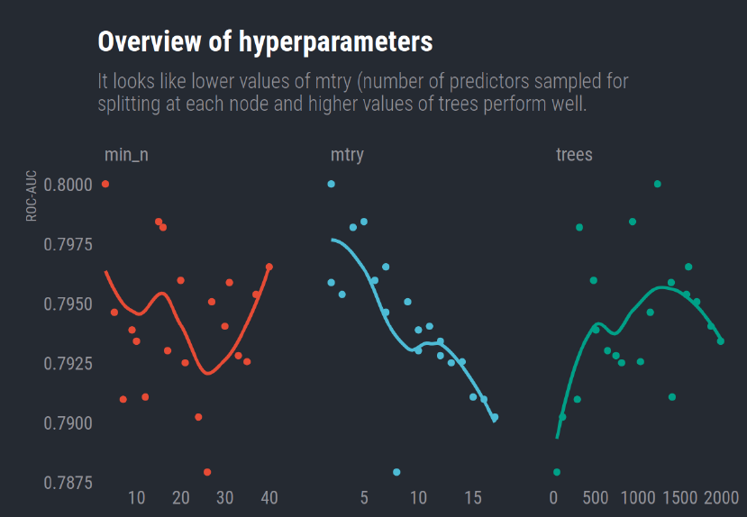
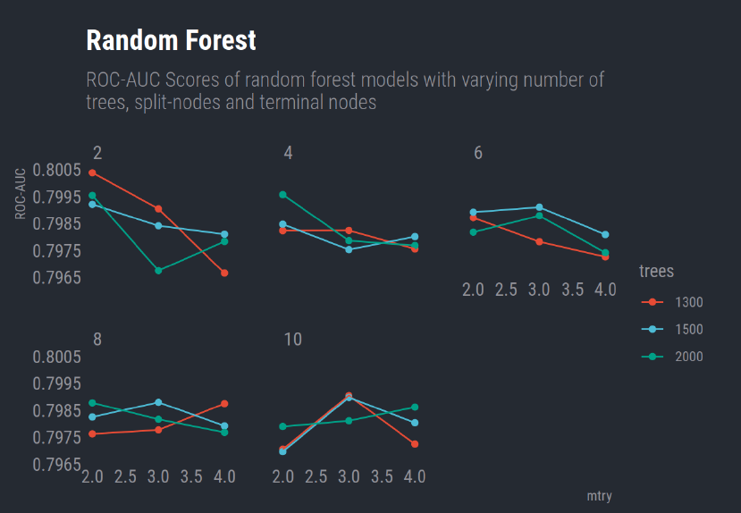
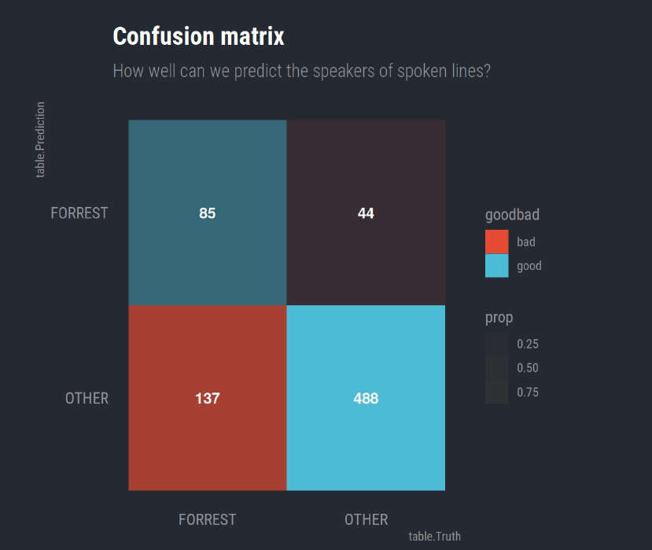

# Random_Forrest :deciduous_tree: :deciduous_tree: :deciduous_tree:
In this analysis we will use linguistic features of sentences and tune hyperparameters of random forest models to predict the speaker (Forrest Gump vs anyone else) of spoken lines in the movie “Forrest Gump” by Robert Zemeckis. Code is written in R and we will use tidyverse, tidymodels and parallelized processing to accomplish this task. To avoid copyright issues, the data will not be shared.

